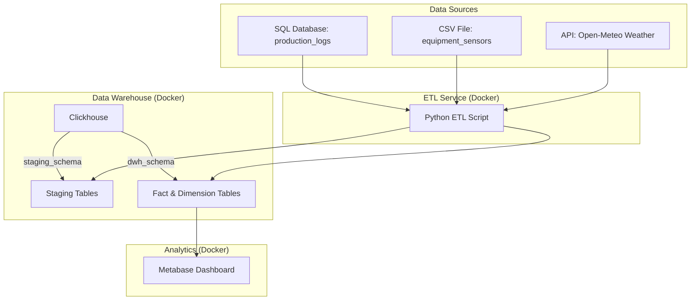

# AI-Powered Coal Mine Data Pipeline

This project implements a complete ETL (Extract, Transform, Load) data pipeline for a coal mining company, designed to optimize operations through data-driven insights. It collects data from various sources (SQL database, IoT sensors via CSV, and a weather API), processes it, and loads it into a Clickhouse data warehouse. The entire ecosystem is containerized with Docker for reproducibility and ease of deployment. Key metrics are visualized on a Metabase dashboard.

---

## Table of Contents
- [Architecture](#architecture)
- [Key Features](#key-features)
- [Data Schema](#data-schema)
- [ETL Pipeline](#etl-pipeline)
- [Getting Started](#getting-started)
- [Accessing Services](#accessing-services)
- [Project Structure](#project-structure)
- [Logging and Monitoring](#logging-and-monitoring)
- [Future Work](#future-work)
- [Stopping and Cleaning Up](#stopping-and-cleaning-up)

---

## Architecture

The pipeline follows a modern data stack architecture, orchestrated with Docker Compose.



- **Data Sources**: Raw data comes from a SQL database, a CSV file, and an external weather API.
- **ETL Service**: A Python script running in a Docker container extracts, transforms, validates, and loads the data.
- **Data Warehouse**: Clickhouse, a high-performance columnar database, stores the data in staging and DWH schemas.
- **Analytics**: Metabase provides an interface for building dashboards and visualizing the metrics from the DWH.

---

## Key Features
- **Automated ETL Pipeline**: Extracts, transforms, and loads data from multiple sources.
- **Data Validation**: Ensures data quality with built-in checks for anomalies.
- **Containerized Services**: Docker-based setup for easy and consistent deployment.
- **Star Schema DWH**: Optimized for analytical queries in Clickhouse.
- **Interactive Dashboard**: Visualizes key performance indicators in Metabase.
- **Robust Logging**: Detailed logs for both the ETL process and data validation.

---

## Data Schema

The project uses a two-layer database design: a staging area for raw data and a data warehouse (DWH) with a star schema for analytics. 

For a detailed explanation of the tables, relationships, and an ERD, please see the [**Database Schema Documentation**](database/SCHEMA_AND_ERD.md).

---

## ETL Pipeline

The core logic for data processing is contained in the ETL scripts. The pipeline handles data extraction, calculation of key metrics, data validation, and loading into the DWH.

For a complete breakdown of the ETL process and scripts, refer to the [**ETL Process Documentation**](etl/ETL_PROCESS.md).

---

## Getting Started

Follow these steps to build and run the entire pipeline.

### Prerequisites
- Docker
- Docker Compose

### 1. Build the Docker Images
First, build the Docker images for all services defined in `docker-compose.yml`.
```sh
docker-compose build
```

### 2. Initialize the Database (One-Time Setup)
This step creates the database schemas (`staging` and `dwh`), loads initial raw data, and creates analytical views in Clickhouse. This only needs to be run once.
```sh
docker-compose run --rm etl bash /app/init.sh
```

### 3. Run the ETL Pipeline
This command executes the main ETL script (`etl.py`). It extracts data from staging, fetches weather data, transforms it into the star schema, validates it, and loads it into the DWH. This command can be run multiple times to refresh the data.
```sh
docker-compose run --rm etl
```

### 4. Start All Services
To run the Clickhouse database and Metabase analytics platform in the background:
```sh
docker-compose up -d
```

---

## Accessing Services
- **Metabase**: [http://localhost:3001](http://localhost:3001)
- **Clickhouse HTTP Interface**: [http://localhost:8123](http://localhost:8123)
- **Clickhouse Native Client**: `localhost:9000`

When setting up Metabase for the first time, you will need to connect it to the Clickhouse database using the service name from `docker-compose.yml`:
- **Database type**: Clickhouse
- **Host**: `clickhouse`
- **Port**: `8123`
- **Database name**: `dwh`
- **Username**: `admin`
- **Password**: `admin`

---

## Project Structure
```
.
├── data/                  # Raw data files (CSVs)
├── database/              # SQL scripts for schemas, data, and views
│   ├── views/
│   ├── production_logs.sql
│   ├── staging_schema.sql
│   └── star_schema.sql
├── etl/                   # ETL logic, scripts, and Dockerfile
│   ├── logs/              # Directory for ETL and validation logs
│   ├── crontab
│   ├── Dockerfile
│   ├── etl.py
│   ├── monitor_etl.py
│   ├── requirements.txt
│   └── validation.py
├── docker-compose.yml     # Defines and configures all services
└── README.md              # This file
```

---

## Logging and Monitoring
The pipeline includes a robust logging and data validation system.
- **Log Directory**: All logs are stored in `etl/logs/`.
- **Run-Specific Logs**: Each ETL run creates a new directory named `etl/logs/run_YYYYMMDD_HHMMSS/`.
- **Log Files**: Inside each run directory, you will find `etl.log` (for the main process) and `validation.log` (for data quality checks).

---

## Future Work
- **Predictive Modeling**: Implement a time-series forecasting model (e.g., ARIMA, Prophet) to predict next-day coal production, as outlined in the project challenge's bonus task.
- **CI/CD Integration**: Set up a continuous integration pipeline (e.g., using GitHub Actions) to automate testing and deployment.
- **Advanced Alerting**: Integrate a more sophisticated alerting system (e.g., email, Slack notifications) for ETL failures or critical data anomalies.

---

## Stopping and Cleaning Up
- **To stop all running services**: 
  ```sh
  docker-compose down
  ```
- **To stop and remove all data volumes** (this will reset your Clickhouse database and Metabase setup): 
  ```sh
  docker-compose down -v
  ```