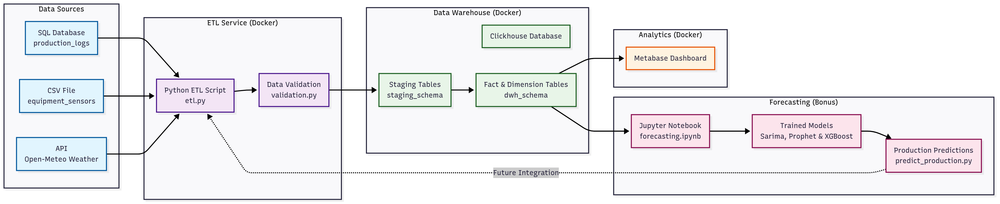

# AI-Powered Coal Mine Data Pipeline

This project implements a complete ETL (Extract, Transform, Load) data pipeline for a coal mining company, designed to optimize operations through data-driven insights. It collects data from various sources (SQL database, IoT sensors via CSV, and a weather API), processes it, and loads it into a Clickhouse data warehouse. The entire ecosystem is containerized with Docker for reproducibility and ease of deployment. Key metrics are visualized on a Metabase dashboard.

---

## Table of Contents
- [Architecture](#architecture)
- [Key Features](#key-features)
- [Data Schema](#data-schema)
- [ETL Pipeline](#etl-pipeline)
- [Forecasting Model](#forecasting-model)
- [Getting Started](#getting-started)
- [Accessing Services](#accessing-services)
- [Project Structure](#project-structure)
- [Logging and Monitoring](#logging-and-monitoring)
- [Future Work](#future-work)
- [Stopping and Cleaning Up](#stopping-and-cleaning-up)

---

## Architecture

The pipeline follows a modern data stack architecture, orchestrated with Docker Compose.




- **Data Sources**: Raw data comes from a SQL database, a CSV file, and an external weather API.
- **ETL Service**: A Python script running in a Docker container extracts, transforms, validates, and loads the data.
- **Data Warehouse**: Clickhouse, a high-performance columnar database, stores the data in staging and DWH schemas.
- **Analytics**: Metabase provides an interface for building dashboards and visualizing the metrics from the DWH.

---

## Key Features
- **Automated ETL Pipeline**: Extracts, transforms, and loads data from multiple sources.
- **Data Validation**: Ensures data quality with built-in checks for anomalies.
- **Containerized Services**: Docker-based setup for easy and consistent deployment.
- **Star Schema DWH**: Optimized for analytical queries in Clickhouse.
- **Interactive Dashboard**: Visualizes key performance indicators in Metabase.
- **Robust Logging**: Detailed logs for both the ETL process and data validation.

---

## Data Schema

The project uses a two-layer database design: a staging area for raw data and a data warehouse (DWH) with a star schema for analytics. 

For a detailed explanation of the tables, relationships, and an ERD, please see the [**Database Schema Documentation**](database/SCHEMA_AND_ERD.md).

## Project Documentation

### 📋 **Brief Implementation Report**
- **PDF Version**: [AI Engineer Challenge Brief Report (M. Rafi Syafrinaldi)](report/AI%20Engineer%20Challenge%20Brief%20Report%20Synapsis%20(M.%20Rafi%20Syafrinaldi).pdf)
- **Online Version**: [Overleaf Document](https://www.overleaf.com/read/trfwqgmmyyjg#399572)
- **Content**: Pipeline design, ETL process, and validation steps (1-2 pages as per challenge requirements)

---

## ETL Pipeline

The core logic for data processing is contained in the ETL scripts. The pipeline handles data extraction, calculation of key metrics, data validation, and loading into the DWH.

For a complete breakdown of the ETL process and scripts, refer to the [**ETL Process Documentation**](etl/ETL_PROCESS.md).

---

## Forecasting Model

This project includes a **bonus forecasting component** that implements time-series forecasting to predict next-day coal production. The forecasting system uses historical production data along with weather and equipment metrics to build predictive models.

### Key Features
- **Multiple Model Types**: Implements both Prophet (Facebook's time-series forecasting library) and XGBoost models
- **Feature Engineering**: Incorporates weather data, equipment utilization, and historical production patterns
- **Model Persistence**: Trained models are saved and can be used for production predictions
- **Interactive Analysis**: Jupyter notebook for exploratory data analysis and model development

### Forecasting Components

#### 📊 **Interactive Notebook**
- **File**: [`forecast/notebooks/forecasting.ipynb`](forecast/notebooks/forecasting.ipynb)
- **Purpose**: Complete forecasting workflow including data exploration, feature engineering, model training, and evaluation
- **Features**: 
  - Data preprocessing and feature creation
  - Model comparison between Prophet and XGBoost
  - Hyperparameter tuning and cross-validation
  - Model performance visualization
  - Production prediction pipeline

#### 🤖 **Production Prediction Script**
- **File**: [`forecast/predict_production.py`](forecast/predict_production.py)
- **Purpose**: Standalone script for making production predictions using trained models
- **Usage**: Can be integrated into the ETL pipeline or run independently

#### 📚 **Forecasting Documentation**
- **File**: [`forecast/README.md`](forecast/README.md)
- **Purpose**: Detailed documentation of the forecasting methodology, model selection, and implementation details

### Getting Started with Forecasting

1. **Explore the Notebook**: Open [`forecast/notebooks/forecasting.ipynb`](forecast/notebooks/forecasting.ipynb) to understand the complete forecasting workflow
2. **Run Predictions**: Use the production script for automated predictions
3. **Review Documentation**: Check [`forecast/README.md`](forecast/README.md) for detailed methodology

---

## Getting Started

Follow these steps to build and run the entire pipeline. This will set up a complete data analytics environment with ETL pipeline, data warehouse, and interactive dashboards.

### Prerequisites
- **Docker** (version 20.10 or higher)
- **Docker Compose** (version 2.0 or higher)
- **Git** (for cloning the repository)

### Quick Start (Complete Setup)

For a complete automated setup, run these commands in sequence:

```sh
# 1. Build all Docker images
docker-compose build

# 2. Start all services (Clickhouse + Metabase)
docker-compose up -d

# 3. Initialize database and load initial data (one-time setup)
docker-compose run --rm etl bash /app/init.sh

# 4. Run ETL pipeline to process data
docker-compose run --rm etl python /app/etl/etl.py

# 5. Create dashboard manually in Metabase (see instructions below)
```

### Detailed Steps

#### 1. Build the Docker Images
Build all services including ETL, Clickhouse, Metabase, and dashboard setup:
```sh
docker-compose build
```

#### 2. Start All Services
Start the Clickhouse database and Metabase analytics platform in the background:
```sh
docker-compose up -d
```

#### 3. Initialize the Database (One-Time Setup)
This step creates the database schemas (`staging` and `dwh`), loads initial raw data, and creates analytical views in Clickhouse:
```sh
docker-compose run --rm etl bash /app/init.sh
```

#### 4. Run the ETL Pipeline
This command executes the main ETL script (`etl.py`). It extracts data from staging, fetches weather data, transforms it into the star schema, validates it, and loads it into the DWH:
```sh
docker-compose run --rm etl python /app/etl/etl.py
```

#### 5. Set Up Metabase and Create Dashboard (One-Time Setup)

1. **Access Metabase Setup**: Open [http://localhost:3001](http://localhost:3001) in your browser
2. **Complete Setup Wizard**: 
   - Create admin user: `admin` / `admin`
   - Add Clickhouse database connection:
     - **Database type**: Clickhouse
     - **Host**: `clickhouse`
     - **Port**: `8123`
     - **Database name**: `dwh`
     - **Username**: `admin`
     - **Password**: `admin`
3. **Create Dashboard Manually**: After setup, create the required visualizations:
   - **Line Chart**: Daily production trends (`total_production_daily`) over time
   - **Bar Chart**: Average quality grade comparison across mines (`mine_id`)
   - **Scatter Plot**: Relationship between rainfall (`rainfall_mm`) and daily production (`total_production_daily`)

### What Gets Created

After running all steps, you'll have:

✅ **Complete ETL Pipeline** - Data extraction, transformation, and loading  
✅ **Data Warehouse** - Star schema with fact and dimension tables  
✅ **Interactive Dashboard** - Manual creation of required charts for production analysis  
✅ **Automated Setup** - Reproducible environment for any user  
✅ **Controlled Execution** - ETL only runs when explicitly called  
✅ **Manual Dashboard Creation** - Create charts as specified in the challenge requirements  

### Access Your Analytics

Once setup is complete, access your analytics at:
- **📊 Metabase Dashboard**: [http://localhost:3001](http://localhost:3001)
- **🗄️ Clickhouse HTTP**: [http://localhost:8123](http://localhost:8123)
- **🔌 Clickhouse Native**: `localhost:9000`

---

## Accessing Services

### 📊 Metabase Dashboard
- **URL**: [http://localhost:3001](http://localhost:3001)
- **Default Credentials**: `admin` / `admin`
- **Features**: 10 interactive charts for coal mining analytics

### 🗄️ Clickhouse Database
- **HTTP Interface**: [http://localhost:8123](http://localhost:8123)
- **Native Client**: `localhost:9000`
- **Default Credentials**: `admin` / `admin`

### 🔧 Metabase Database Connection

When setting up Metabase for the first time, connect to Clickhouse using:
- **Database type**: Clickhouse
- **Host**: `clickhouse`
- **Port**: `8123`
- **Database name**: `dwh`
- **Username**: `admin`
- **Password**: `admin`

**Note**: You'll need to manually create the dashboard and charts as specified in the challenge requirements.

### 📈 Required Dashboard Charts

As per the challenge requirements, create the following visualizations in Metabase:

#### **Coal Mining Analytics Dashboard**
- **Line Chart**: Daily production trends (`total_production_daily`) over one month
- **Bar Chart**: Comparison of average quality grade (`average_quality_grade`) across mines (`mine_id`)
- **Scatter Plot**: Relationship between rainfall (`rainfall_mm`) and daily production (`total_production_daily`)

**Data Sources**: All charts should use data from the `dwh.fact_daily_production` table.

---

## Project Structure
```
.
├── data/                  # Raw data files (CSVs)
├── database/              # SQL scripts for schemas, data, and views
│   ├── views/
│   ├── production_logs.sql
│   ├── staging_schema.sql
│   └── star_schema.sql
├── dashboard/             # Dashboard documentation
│   └── DASHBOARD_DOCUMENTATION.md
├── etl/                   # ETL logic, scripts, and Dockerfile
│   ├── logs/              # Directory for ETL and validation logs
│   ├── crontab
│   ├── Dockerfile
│   ├── etl.py
│   ├── monitor_etl.py
│   ├── requirements.txt
│   └── validation.py
├── forecast/              # Forecasting models and analysis
│   ├── notebooks/
│   │   └── forecasting.ipynb  # Interactive forecasting workflow
│   ├── models/            # Trained model files
│   ├── clickhouse_connector.py
│   ├── predict_production.py
│   └── README.md
├── docker-compose.yml     # Defines and configures all services
└── README.md              # This file
```

---

## Logging and Monitoring
The pipeline includes a robust logging and data validation system.
- **Log Directory**: All logs are stored in `etl/logs/`.
- **Run-Specific Logs**: Each ETL run creates a new directory named `etl/logs/run_YYYYMMDD_HHMMSS/`.
- **Log Files**: Inside each run directory, you will find `etl.log` (for the main process) and `validation.log` (for data quality checks).

---

## Future Work
- **Enhanced Forecasting**: Expand the forecasting model with additional features like seasonal patterns, equipment maintenance schedules, and market demand indicators.
- **Real-time Predictions**: Integrate the forecasting model into the ETL pipeline for real-time production predictions.
- **CI/CD Integration**: Set up a continuous integration pipeline (e.g., using GitHub Actions) to automate testing and deployment.
- **Advanced Alerting**: Integrate a more sophisticated alerting system (e.g., email, Slack notifications) for ETL failures or critical data anomalies.

---

## Stopping and Cleaning Up
- **To stop all running services**: 
  ```sh
  docker-compose down
  ```
- **To stop and remove all data volumes** (this will reset your Clickhouse database and Metabase setup): 
  ```sh
  docker-compose down -v
  ```

## Troubleshooting

### ETL Execution Control
The ETL container is configured to **not run automatically** when services start. This prevents unintended data processing and ensures you have full control over when the ETL runs.

- **To run initialization only**: `docker-compose run --rm etl bash /app/init.sh`
- **To run ETL only**: `docker-compose run --rm etl python /app/etl/etl.py`
- **To run both**: Execute the commands in sequence

### Common Issues
- **Container connection errors**: Ensure Clickhouse is fully started before running ETL commands.
- **Dashboard creation**: Follow the manual setup steps in section 5 to create the required charts as specified in the challenge.
