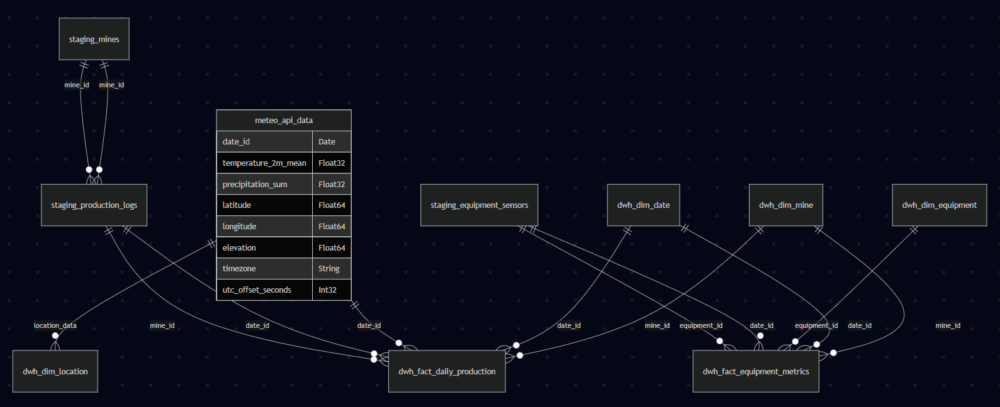

# Database Schemas and ERD

This document explains the structure of the schemas in the `database/` folder, including the staging schema, star schema (data warehouse), and analytical views. An Entity-Relationship Diagram (ERD) overview is also provided.

---

## 1. Staging Schema (`staging_schema.sql`)

The staging schema is used for raw data ingestion and temporary storage before transformation and loading into the data warehouse.

### Tables
- **staging.mines**
  - `mine_id` (UInt32): Unique identifier for the mine
  - `mine_code` (String): Code for the mine
  - `mine_name` (String): Name of the mine
  - `location` (String): Location of the mine
  - `operational_status` (String): Status (e.g., active, inactive)

- **staging.production_logs**
  - `log_id` (UInt32): Unique log entry
  - `date` (Date): Log date
  - `mine_id` (UInt32): Foreign key to `mines`
  - `shift` (String): Shift name
  - `tons_extracted` (Decimal64(2)): Tons extracted
  - `quality_grade` (Decimal32(1)): Quality grade

- **staging.equipment_sensors**
  - `timestamp` (DateTime): Event timestamp
  - `equipment_id` (String): Equipment identifier
  - `status` (String): Status
  - `fuel_consumption` (Float64): Fuel used
  - `maintenance_alert` (Boolean): Maintenance alert flag

---

## 2. Data Warehouse Star Schema (`star_schema.sql`)

The star schema is designed for analytics and reporting, with fact and dimension tables.

### Dimension Tables
- **dwh.dim_date**
  - `date_id` (Date): Primary key
  - `year`, `month`, `day`, `day_of_week`, `quarter`, `is_weekend`

- **dwh.dim_mine**
  - `mine_id` (String): Primary key
  - `location`, `type`, `opened_date`

- **dwh.dim_equipment**
  - `equipment_id` (String): Primary key
  - `equipment_type`, `last_maintenance_date`

- **dwh.dim_location**
  - `location_id` (UInt64): Primary key
  - `latitude`, `longitude`, `elevation`, `timezone`, `utc_offset_seconds`

### Fact Tables
- **dwh.fact_daily_production**
  - `date_id` (Date): FK to `dim_date`
  - `mine_id` (String): FK to `dim_mine`
  - `total_production_daily`, `average_quality_grade`, `equipment_utilization`, `fuel_efficiency`, `temperature_2m_mean`, `precipitation_sum`

- **dwh.fact_equipment_metrics**
  - `date_id` (Date): FK to `dim_date`
  - `equipment_id` (String): FK to `dim_equipment`
  - `mine_id` (String): FK to `dim_mine`
  - `total_operational_hours`, `total_maintenance_hours`, `total_fuel_consumption`, `maintenance_alerts`

---

## 3. Analytical Views (`views/analytical_views.sql`)

- **dwh.daily_summary_metrics**: Aggregates daily KPIs (production, quality, utilization, fuel efficiency) from `fact_daily_production`.
- **dwh.weather_impact_analysis**: Analyzes the impact of rainfall on production, categorizing days and calculating correlation between rainfall and production.

---

## 4. ERD Overview

---

## 5. Data Flow Summary

### **Staging to DWH Flow:**
1. **Production Data**: `staging.production_logs` → `dwh.fact_daily_production` (aggregated by date and mine)
2. **Equipment Data**: `staging.equipment_sensors` → `dwh.fact_equipment_metrics` (aggregated by date and equipment)
3. **Mine Data**: `staging.mines` → `dwh.dim_mine` (direct mapping)
4. **Date Data**: Generated from production dates → `dwh.dim_date`
5. **Equipment Data**: Generated from sensor data → `dwh.dim_equipment`

### **Weather API Integration:**
- **Weather Metrics**: API response → `dwh.fact_daily_production` (temperature, precipitation)
- **Location Data**: API response → `dwh.dim_location` (coordinates, elevation, timezone)

---

**Note:**
- Staging tables are for raw/temporary data; DWH tables are for analytics.
- Fact tables reference dimension tables via foreign keys.
- Weather data comes from Open-Meteo API for Berau, Kalimantan, Indonesia.
- Location data is dynamically extracted from the weather API response.
- Analytical views provide ready-to-use metrics for dashboards and analysis. 