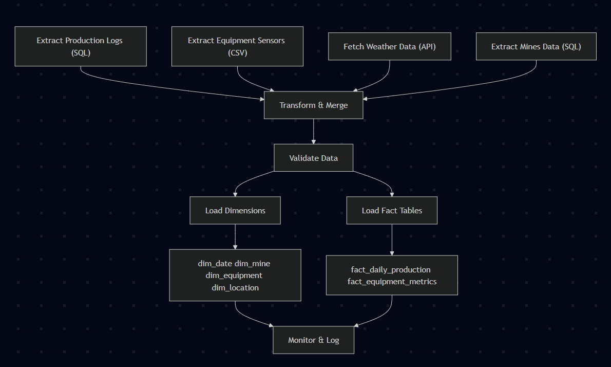

# ETL Process Documentation

This document explains the ETL (Extract, Transform, Load) pipeline and all jobs/scripts in the `etl/` folder for the Synapsis Mining Data Project.

---

## Overview
The ETL pipeline automates the flow of data from raw sources (SQL, CSV, API) into a data warehouse (DWH) for analytics and dashboarding. It ensures data quality through validation and supports monitoring for reliability. The pipeline implements a complete star schema with dimension and fact tables.

---

## ETL Pipeline Steps

### 1. **Extraction**
- **Production Logs:** Extracted from the `staging.production_logs` SQL table.
- **Equipment Sensors:** Read from `equipment_sensors.csv` (IoT sensor data).
- **Mines Data:** Extracted from `staging.mines` SQL table.
- **Weather Data:** Fetched from the Open-Meteo API for Berau, Kalimantan, Indonesia, retrieving daily mean temperature and precipitation, along with location metadata (coordinates, elevation, timezone).

### 2. **Transformation**
- **Production Data:** Aggregated by day and mine to compute total production and average quality.
- **Equipment Data:** Aggregated by day and equipment_id to compute operational hours, maintenance hours, fuel consumption, and alerts.
- **Weather Data:** Merged by date with production and equipment data.
- **Location Data:** Extracted from weather API response for geographical coordinates and timezone information.
- **Metrics Calculated:**
  - `total_production_daily`: Total tons mined per day
  - `average_quality_grade`: Average coal quality per day
  - `equipment_utilization`: % of time equipment is active per day
  - `fuel_efficiency`: Tons mined per unit of fuel
  - `weather_impact`: Correlation between rainfall and production (for analysis)

### 3. **Validation**
- Checks for negative production values, out-of-range utilization, and missing weather data.
- Handles empty weather data gracefully with appropriate warnings.
- Anomalies are logged for review and data is corrected where possible.

### 4. **Loading**
- **Dimension Tables:** Populated with data from staging and API sources:
  - `dim_date`: Date dimension with year, month, day, quarter, weekend flags
  - `dim_mine`: Mine information from staging data
  - `dim_equipment`: Equipment metadata from sensor data
  - `dim_location`: Geographical data from weather API response
- **Fact Tables:** Loaded with transformed metrics:
  - `fact_daily_production`: Daily production metrics with weather data
  - `fact_equipment_metrics`: Equipment performance metrics by date and equipment

---

## ETL Folder Job Descriptions

### - `etl.py`
Main ETL script. Orchestrates extraction, transformation, validation, and loading. Handles logging and error management. Includes functions for:
- `extract_data()`: Extracts data from staging tables
- `fetch_weather_data()`: Retrieves weather and location data from API
- `transform_data()`: Transforms and merges data from all sources
- `load_dimensions()`: Populates all dimension tables
- `load_equipment_metrics()`: Loads equipment fact table
- `load_to_dwh()`: Orchestrates the complete loading process

### - `validation.py`
Contains the `DataValidator` class. Implements data quality checks, anomaly detection, and logging of validation results. Includes:
- Production data validation (negative values)
- Equipment utilization validation (0-100% range)
- Weather data completeness validation
- Graceful handling of missing or empty data

### - `monitor_etl.py`
Script to monitor ETL runs, check logs, and alert on failures or anomalies.

### - `test_scrape_weather.py`
Test script for weather data extraction. Used to validate API integration and data structure before running the main ETL.

### - `crontab`
Defines the schedule for automated ETL runs (e.g., daily at a set time).

### - `Dockerfile`
Defines the Docker image for the ETL environment, ensuring reproducibility and easy deployment.

### - `requirements.txt`
Lists Python dependencies for the ETL scripts.

### - `logs/`
Stores log files for each ETL run, including both process and validation logs.

---

## ETL Process Flow Diagram

---

## Data Flow Details

### **Dimension Table Population:**
1. **dim_date**: Created from unique dates in production data
2. **dim_mine**: Populated from staging.mines table
3. **dim_equipment**: Created from unique equipment IDs in sensor data
4. **dim_location**: Populated with geographical data from weather API response

### **Fact Table Population:**
1. **fact_daily_production**: Aggregated daily metrics with weather data
2. **fact_equipment_metrics**: Equipment performance metrics by date and equipment

### **Data Sources Integration:**
- **Staging Tables**: SQL database with production logs and mine information
- **CSV Files**: Equipment sensor data from IoT devices
- **External API**: Weather data with location metadata from Open-Meteo

---

## Notes
- The ETL process is automated and can be scheduled via cron or other orchestrators.
- All logs are stored in `etl/logs/` for traceability.
- The pipeline is containerized for easy deployment and reproducibility.
- Location data is dynamically extracted from the weather API response.
- The pipeline implements a complete star schema for optimal analytical performance. 